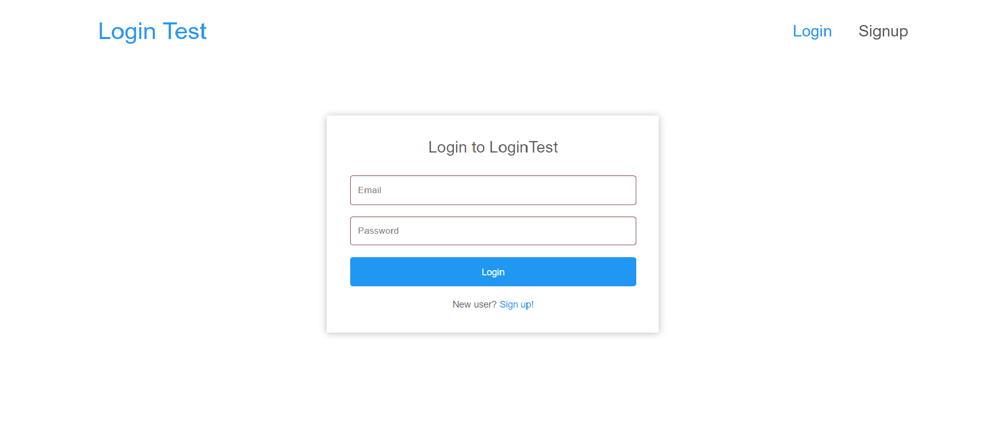

# Login System Demo



## 設定後端伺服器 Setting up the Backend Server (spring)

**建立MySQL資料庫**

```bash
mysql> create database login_system
```

**設置資料庫username和password**

```yaml
# spring-back-end/src/main/resources/application.yaml
spring:
	datasource:
	    url: jdbc:mysql://localhost:3306/login_system?useSSL=false
	    username: <YOUR_DB_USERNAME>
	    password: <YOUR_DB_PASSWORD>
```

**Run spring-social**
```bash
gradle bootrun
```

## 設定前端伺服器 Setting up the Frontend Server (react)

```bash
npm install && npm start
```